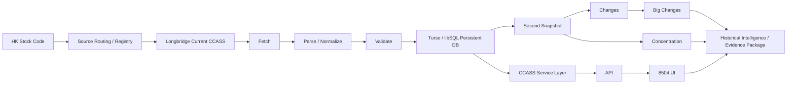

# PROJECT_PROGRESS.md

# Joe CCASS Platform - Project Progress & CodeGeeX Handoff

> **Handoff date:** 2026-09-17  
> **Project:** Joe CCASS Platform  
> **Repository:** `Joelikecoin/joe-ccass-platform`  
> **Primary production service:** `joe-ccass-api` on Render  
> **Current production branch:** `openhands/p0-runtime-api-key-fingerprint-proof`  
> **Current deployed commit:** `3324d8625d682c304e875d94867a1cc59e362da5`  
> **Render runtime:** Docker  
> **Render Dockerfile:** `./Dockerfile`  
> **Latest Docker redeploy:** `dep-dalvpk142hec73dsi6i0` = `LIVE`  
> **Current P0:** prove the real production journey for a genuinely unseen HK stock.

---

## 0. Read This First - Project Governance

This is **not a greenfield redesign project**.

The only acceptable engineering workflow is:

```text
Reference
  -> Current
  -> Gap
  -> Earliest Root Cause
  -> Minimal Fix
  -> Runtime Verify
```

The project is governed by **Clone-First Governance**.

The friend/reference implementation is the Golden Master wherever real evidence exists.  
Do not replace a proven reference behavior with a new design just because another design is cleaner.

### Reference authority order

Before any architecture change or major fix, inspect:

1. `docs_reference_evidence/friend_engineering_evidence`
2. `docs_reference_evidence/02_Friend_Architecture/CCASS_Codex_Handover_20260814`
3. `docs_reference_evidence/01_Reference_Website`
4. `docs_reference_evidence/00_Source_Documents`
5. `docs_reference_evidence/latest_reference_updates`
6. `docs/REFERENCE_SPEC.md`
7. `docs/ARCHITECTURE.md`
8. `docs/PROJECT_SPEC.md`

If a referenced folder is not present in the checked branch, do not invent its contents. Search the configured reference workspace / Drive evidence before changing architecture.

### Non-negotiable engineering rule

> **Fail Loud, Never Fake.**

The following are **not** product completion evidence by themselves:

- tests passed
- HTTP 200
- route exists
- fixture passed
- mock passed
- cached result exists
- fallback returned something
- UI section exists
- `skipped=True`
- stale/old data presented as fresh
- synthetic data presented as production data

---

# 1. Project Background

## Project Name

**Joe CCASS Platform**

## Product Positioning

Hong Kong equity CCASS data relay, normalization, persistence and analysis platform.

The platform is intended to turn fragmented public / broker / archival data into a trustworthy stock-level evidence package for:

- CCASS participant holdings
- broker / participant holding changes
- Big Changes
- Concentration
- historical CCASS reconstruction
- HKEX announcements
- disclosure of interests (DI)
- share capital history
- officers / directors
- fundamentals
- corporate events
- intermediaries / advisers / offerors / placing agents / underwriters
- whitewash / concert-party evidence
- price / volume history
- provenance / coverage
- downstream AI financial engineering analysis

The long-term user-facing target is not merely a 1-2 day CCASS screen.  
The target is a **high-quality 20-30 page financial engineering analysis capability**, including a **5-year corporate / capital markets story line** (or since listing if listed for less than 5 years).

---

# 2. Technical Stack

## Core backend

- **Python**
- **FastAPI**
- **Uvicorn**
- `app/api.py`
- `app/portal_8504.py`

## Data / persistence

- **Turso / libSQL** for production persistent database
- SQLite-compatible repositories and migrations
- historical canonical SQLite materialization for Webb archive evidence
- idempotent persistence patterns

Important storage files include:

```text
app/storage/history.py
app/storage/longbridge_store.py
app/storage/announcements.py
app/storage/disclosure_interests.py
app/storage/fundamentals.py
app/storage/document_entities.py
app/storage/migrations.py
```

## External data sources

- **Longbridge** - current CCASS / broker holdings source
- **Webb historical archive** - historical participant-level CCASS reconstruction
- **HKEXnews** - announcements / financial documents / corporate-event source
- **HKEX DION** - Disclosure of Interests
- **HKEX SDW / related HKEX sources** - selected verification / CCASS source work
- **Yahoo Finance** - price history primary path where applicable
- Google Drive CSV adapter exists for configured evidence/data workflows

## Browser runtime

- **Playwright 1.51.0**
- Chromium required for HKEX DION browser flow
- Production service has now been switched to **Render Docker runtime**

## Deployment

- **Render**
- Service: `joe-ccass-api`
- Region: Singapore
- Docker context: `.`
- Dockerfile: `./Dockerfile`
- auto deploy: off
- current branch: `openhands/p0-runtime-api-key-fingerprint-proof`

## UI / presentation

- FastAPI-based 8504 portal: `app/portal_8504.py`
- Streamlit code also exists:
  - `app/streamlit_ui.py`
  - `streamlit_app.py`

## Testing

- `pytest`
- broad component tests under `tests/`
- production acceptance is **not equivalent** to unit/integration tests

---

# 3. Repository Structure - High-Level Map

CodeGeeX should treat the following as the primary architecture map.

```text
joe-ccass-platform/
|
|-- Dockerfile
|-- requirements.txt
|-- pyproject.toml
|-- README.md
|-- TASK.md
|-- HANDOFF_20260905.md
|
|-- app/
|   |-- api.py
|   |-- portal_8504.py
|   |-- live_product.py
|   |-- daily_snapshot.py
|   |-- backfill_ccass.py
|   |-- canonical_historical_import.py
|   |-- import_webb_canonical.py
|   |-- longbridge_persistence.py
|   |-- models.py
|   |
|   |-- core/
|   |   `-- normalizers.py
|   |
|   |-- domain/
|   |   `-- history.py
|   |
|   |-- services/
|   |   |-- ccass.py
|   |   |-- latest_holdings.py
|   |   |-- changes.py
|   |   |-- big_changes.py
|   |   |-- concentration.py
|   |   |-- historical_intelligence.py
|   |   |-- announcements.py
|   |   |-- disclosure_interests.py
|   |   |-- share_capital_history.py
|   |   |-- fundamentals.py
|   |   |-- officers.py
|   |   |-- corporate_timeline.py
|   |   |-- document_entities.py
|   |   |-- price_history.py
|   |   |-- data_gateway.py
|   |   `-- data_quality_validation.py
|   |
|   |-- sources/
|   |   |-- longbridge.py
|   |   |-- webbsite.py
|   |   |-- webbsite_historical.py
|   |   |-- webbsite_parser.py
|   |   |-- announcements.py
|   |   |-- disclosure_interests.py
|   |   |-- share_capital_history.py
|   |   |-- fundamentals.py
|   |   |-- officers.py
|   |   |-- stock_events.py
|   |   |-- document_entities.py
|   |   |-- price_history.py
|   |   |-- hkex_sdw.py
|   |   |-- hkex_sdw_parser.py
|   |   |-- google_drive_csv.py
|   |   `-- registry.py
|   |
|   `-- storage/
|       |-- history.py
|       |-- longbridge_store.py
|       |-- announcements.py
|       |-- disclosure_interests.py
|       |-- fundamentals.py
|       |-- document_entities.py
|       `-- migrations.py
|
|-- ccass_core/
|   |-- collector.py
|   |-- compute.py
|   |-- changes_report.py
|   |-- big_changes_report.py
|   |-- concentration_report.py
|   |-- source_trace.py
|   |-- research_context.py
|   |-- research_context_handoff.py
|   |-- ai_read_model.py
|   |-- ai_research_context_*.py
|   `-- report.py
|
|-- docs/
|   |-- ARCHITECTURE.md
|   |-- DATA_SOURCE_GUIDE.md
|   |-- DEVELOPMENT_RULES.md
|   |-- PROJECT_SPEC.md
|   |-- REFERENCE_SPEC.md
|   |-- ROADMAP.md
|   `-- Implementation_Authority_Index.md
|
|-- docs_reference_evidence/
|   |-- PROJECT_EXECUTION_GOVERNANCE_RULE_V2.md
|   |-- latest_reference_updates/
|   |   |-- 2026-09-09_P0_8504_HOME_CODEX_HANDOVER.md
|   |   |-- 2026-09-16_WEBBSITE_CCASS_ROW_PROOF_HANDOFF.md
|   |   `-- 2026-09-17_CCASS_BOUNDARY_AND_WORKSTATE_HANDOFF.md
|   `-- 04_Evidence_Index/
|
`-- tests/
    |-- test_portal_8504.py
    |-- test_disclosure_interests.py
    |-- test_historical_intelligence.py
    |-- test_webbsite_historical.py
    |-- test_longbridge_persistence.py
    |-- test_announcements.py
    |-- test_fundamentals.py
    |-- test_stock_events.py
    |-- test_officers.py
    |-- test_price_history.py
    |-- test_turso_repository.py
    `-- ...
```

---

# 4. CCASS Data Flow

## Current / recent production path



## Historical CCASS path

```mermaid
flowchart LR
    A[Stock Code]
    --> B[Resolve Webb issueID]
    B --> C[Webb Historical holdings sparse rows]
    C --> D[Carry-forward reconstruction by participant]
    D --> E[Participant name mapping]
    E --> F[Applicable historical issued shares]
    F --> G[Stake % calculation]
    G --> H[Canonical Historical Snapshot]
    H --> I[Persistent repository]
    I --> J[Historical Intelligence]
    J --> K[Changes / Big Changes / Concentration]
```



### Historical sparse semantics

Historical Webb holdings are reconstructed as:

```text
For snapshot date D:
for each partID,
use the latest row for target issueID where atDate <= D.
```

Unchanged holdings can be omitted in the source dump.  
Therefore sparse carry-forward is required.

---

# 5. Product Acceptance Gate

The actual P0 gate is:

```text
Stock Code
  -> Source
  -> Fetch
  -> Parse
  -> Validate
  -> Normalize
  -> Persistent DB
  -> Service
  -> API
  -> 8504 UI
  -> Reload / Restart
  -> Next Snapshot
  -> Changes
  -> Big Changes
  -> Concentration
```

For a **genuinely new / never-preloaded stock**, first query must dynamically obtain authoritative data.

## Timing

- target: <= 60 seconds
- hard stop: <= 90 seconds

At 90 seconds, every domain must terminate as one of:

```text
COMPLETE
COMPLETE_ZERO_RECORDS
PARTIAL
STALE
UNAVAILABLE
ERROR
DEFERRED_DATA_GAP
```

No infinite loading.

---

# 6. Dynamic Fresh-Stock Rule

For every previously unseen HK stock:

- do not require preload
- do not require prior user query
- do not require browser history
- do not require manual import
- do not require stock whitelist
- do not use stock-specific hardcoding
- do not treat fixtures as production evidence

Existing persisted data may be reused **only after proving stock/source freshness and coverage validity**.

For event-driven sources:

> A complete real source search that returns zero genuine events should be `COMPLETE_ZERO_RECORDS`, not `UNAVAILABLE`.

---

# 7. Module Completion Checklist

Legend:

- `[x]` component/path materially proven
- `[~]` partially proven / production acceptance still pending
- `[ ]` not accepted
- `[!]` known blocker / deferred gap

## Core CCASS

- [x] Longbridge current holdings fetch path
- [x] parsing / normalization
- [x] Turso/libSQL persistence
- [x] reload/restart persistence previously proven
- [x] second snapshot previously proven
- [x] Changes computation
- [x] Big Changes computation
- [x] Concentration computation
- [x] 8504 core portal path
- [x] Webb historical sparse reconstruction
- [x] participant name mapping
- [x] historical issued-share lookup
- [x] historical stake percentage
- [x] arbitrary-stock historical reconstruction proof
- [!] only accepted CCASS coverage gap:
  - `2025-12-25 -> 2026-07-21`

## Historical proof stocks

Previously proven historical reconstruction includes:

- `00388`
- `01211`
- `01810`
- `00004`

Examples of proven properties include:

- historical issueID resolution
- participant reconstruction
- issued shares
- participant names
- stake %
- multiple snapshot dates
- derived Changes / Big Changes / Concentration

Do not redo this proof unless new contradictory evidence appears.

## HKEX Announcements

- [x] real HKEX prefix / stock ID resolution
- [x] title search
- [x] real HKEX document metadata fetch
- [x] parsing
- [x] persistence path
- [x] service/API component path
- [~] still must pass the final fresh-stock unified production gate

## Disclosure of Interests (DI)

Primary files:

```text
app/sources/disclosure_interests.py
app/services/disclosure_interests.py
app/storage/disclosure_interests.py
tests/test_disclosure_interests.py
app/api.py
app/portal_8504.py
Dockerfile
requirements.txt
```

Component status before Docker production re-verification:

- [x] HKEX DION source identified
- [x] browser-mode source adapter implemented
- [x] parser
- [x] normalization
- [x] local persistence
- [x] local service/API
- [x] prior browser retrieval evidence
- [x] Render service changed from Native Python to Docker
- [x] Docker redeploy is now LIVE
- [~] Chromium inside the **new live Docker container** must now be proven
- [~] real production DI 00388 / 01810 must now be rerun

Previously observed browser evidence:

```text
00388: approximately 309 DION rows
01810: approximately 391 DION rows
```

Exact row counts may change over time.  
Acceptance requires real non-zero authoritative results, not exact historical counts.

## Fundamentals

Primary files:

```text
app/sources/fundamentals.py
app/services/fundamentals.py
app/storage/fundamentals.py
tests/test_fundamentals.py
```

- [x] official HKEXnews financial-document fetch
- [x] parser
- [x] normalized model
- [x] persistence
- [x] local service/API
- [x] multiple real financial periods demonstrated
- [~] final unseen-stock production gate pending

## Intermediaries / document entities / Whitewash

Primary files:

```text
app/sources/document_entities.py
app/services/document_entities.py
app/storage/document_entities.py
tests/test_document_entities.py
```

Real document-level extraction previously demonstrated for examples including:

- placing agent
- offeror
- underwriter
- adviser
- Whitewash Waiver
- concert parties

- [x] deterministic document extraction path
- [x] local persistence/service/API
- [~] final unseen-stock production gate pending

## Corporate Events / Timeline

Primary files:

```text
app/sources/stock_events.py
app/services/stock_events.py
app/services/corporate_timeline.py
tests/test_stock_events.py
tests/test_corporate_timeline.py
```

- [x] HKEX announcement-driven timeline foundation
- [~] richer structured-event completeness is still partial
- [~] must dynamically query for every fresh stock

## Share Capital History

Primary files:

```text
app/sources/share_capital_history.py
app/services/share_capital_history.py
```

- [x] HKEX Monthly Return / document parsing path exists
- [~] full long-range production persistence / unified-gate proof remains incomplete

## Officers / Directors

Primary files:

```text
app/sources/officers.py
app/services/officers.py
tests/test_officers.py
```

- [x] source/service component exists
- [~] current + historical coverage remains partial
- [~] fresh-stock dynamic production verification required

## OHLCV / Turnover

Primary files:

```text
app/sources/price_history.py
app/services/price_history.py
tests/test_price_history.py
```

- [x] source/service component exists
- [~] five-year production coverage gate still needs explicit proof
- [~] estimated turnover must remain clearly labelled when derived

## Unified intelligence / provenance / coverage

Primary files:

```text
app/services/historical_intelligence.py
app/services/data_gateway.py
app/services/data_quality_validation.py
app/sources/registry.py
ccass_core/source_trace.py
ccass_core/research_context.py
ccass_core/ai_research_context_*.py
```

- [x] multi-domain framework exists
- [x] per-domain source/status patterns exist
- [~] final unified fresh-stock production package still not accepted
- [~] only the known CCASS middle gap may be reported as `DEFERRED_DATA_GAP`

---

# 8. Known Production State

## Render

```text
WORKSPACE=My Workspace
WORKSPACE_ID=tea-d9etl8v41pts73fjj86g

SERVICE=joe-ccass-api
SERVICE_ID=srv-dads94740ujc73cpdktg

URL=https://joe-ccass-api.onrender.com

BRANCH=openhands/p0-runtime-api-key-fingerprint-proof
COMMIT=3324d8625d682c304e875d94867a1cc59e362da5

RUNTIME=Docker
DOCKERFILE=./Dockerfile
DOCKER_CONTEXT=.

LATEST_REDEPLOY=dep-dalvpk142hec73dsi6i0
LATEST_REDEPLOY_STATUS=LIVE
```

### Important

The service was previously Native Python.  
That was the reason Playwright Python could be installed while Chromium was not actually provisioned.

The runtime has now been changed to Docker and a fresh redeploy completed.

**Next verification must target the live Docker service.**

Do not use "local machine has no Docker Desktop" as a production blocker.

---

# 9. Current P0 Bugs / Bottlenecks

## P0-1 - Production DI runtime must be re-verified after Docker switch

### Current state

Docker redeploy is now LIVE, but production Chromium + DION E2E has not yet been accepted after the runtime change.

### Inspect these files first

```text
Dockerfile
requirements.txt
app/sources/disclosure_interests.py
app/services/disclosure_interests.py
app/storage/disclosure_interests.py
app/api.py
app/portal_8504.py
tests/test_disclosure_interests.py
```

### Required proof

```text
Docker runtime active
-> Playwright import works
-> Chromium executable exists
-> headless Chromium launches
-> real DION query 00388
-> real DION query 01810
-> parser
-> normalize
-> persist
-> service
-> API
-> idempotent repeat
-> reload/restart persistence
```

### Do not

- rewrite DI source logic before proving a real Docker runtime defect
- replace DION with fake fixtures
- count health 200 as DI success
- stop after browser smoke test

---

## P0-2 - Final ANY_NEW_STOCK unified acceptance has not run

Once DI production passes, select a **genuinely fresh stock that has not been used by the existing proof set**.

Avoid using these as the final unseen-stock test:

```text
00388
01810
00004
00006
00362
00372
08226
01168
01211
```

Before query:

```text
measure PREEXISTING_ROWS_BY_DOMAIN
```

Then from stock code alone trigger:

```text
CURRENT_CCASS
HISTORICAL_CCASS
CCASS_MIDDLE_GAP
CHANGES
BIG_CHANGES
CONCENTRATION
ANNOUNCEMENTS
SHARE_CAPITAL
DI
OFFICERS
FUNDAMENTALS
CORPORATE_EVENTS
INTERMEDIARIES
WHITEWASH_CONCERT
OHLCV_TURNOVER
PROVENANCE
COVERAGE
UNIFIED_EVIDENCE_PACKAGE
```

Then verify:

```text
persistence
reload
restart/redeploy
second query
```

No manual intervention.

---

## P0-3 - CCASS middle historical gap

Accepted known coverage exception:

```text
2025-12-25 -> 2026-07-21
```

This is the **only currently accepted data-gap exception**.

It must not be used as an excuse for missing announcements, DI, fundamentals, events, officers, price history, etc.

### Important source limitation

Longbridge does not provide a complete historical all-participant snapshot interface for arbitrary historical dates.

Single-broker daily observations are not equivalent to complete CCASS snapshots.

### Parallel data-retrieval work

A separate Zhipu/AI workstream may attempt to obtain complete participant-level data for the gap.

Do not fabricate or interpolate the missing snapshots.

---

# 10. Important Historical CCASS Evidence

The historical archive work has already proved:

- `ccass.holdings` contains sparse participant holding rows
- records are effectively `(partID, issueID, holding, atDate)`
- stock code -> issueID mapping works
- participant-name mapping works
- historical issued shares work
- carry-forward reconstruction works
- arbitrary-stock materialization works

The canonical historical SQLite workstate used during engineering was:

```text
D:\WEBBSITE_CCASS_EXTRACT\webbsite_canonical_historical_snapshot.sqlite
```

The large Webb archive was extracted from a Google Drive-backed research pack.

Do **not** automatically repeat the 17 GB SQL extraction or broad indexing work.

---

# 11. Friend "warm_ccass_cache / hybrid_light" Investigation

Current classification:

```text
WARM_FILE_FOUND=NO
FINAL_CLASSIFICATION=NOT_FOUND
```

The actual `warm_ccass_cache.py` call chain has not been found in currently accessible reference evidence.

Therefore the following remain **unproven**:

- actual Webb URL
- exact endpoints
- whether full participant rows are fetched
- whether only summary sections are fetched
- exact historical date parameters
- T-2 / T-5 support
- Turso write schema
- whether it is today-only or historical

Do not redesign Joe's deep participant-level CCASS architecture based only on the claim that friend's warm path is faster.

Until actual reference evidence is found:

```text
FRIEND_WARM_BEHAVIOR=NOT_PROVEN
JOE_DEEP_CCASS_ARCHITECTURE=KEEP
NO_ARCHITECTURE_CHANGE
```

A possible future two-layer architecture may be:

```text
LIGHT historical summary
    - Concentration
    - Big Changes
    - scanner / ranking

DEEP historical participant layer
    - full participant holdings
    - source of truth
    - Changes
    - detailed financial analysis
```

But do not implement this solely from inference.

---

# 12. Files CodeGeeX Should Read First

For fastest onboarding through `@Workspace`, read in this order:

```text
@Workspace PROJECT_PROGRESS.md

@Workspace docs_reference_evidence/PROJECT_EXECUTION_GOVERNANCE_RULE_V2.md
@Workspace docs_reference_evidence/latest_reference_updates/2026-09-17_CCASS_BOUNDARY_AND_WORKSTATE_HANDOFF.md
@Workspace docs_reference_evidence/latest_reference_updates/2026-09-16_WEBBSITE_CCASS_ROW_PROOF_HANDOFF.md
@Workspace docs_reference_evidence/latest_reference_updates/2026-09-09_P0_8504_HOME_CODEX_HANDOVER.md

@Workspace docs/ARCHITECTURE.md
@Workspace docs/REFERENCE_SPEC.md
@Workspace docs/PROJECT_SPEC.md
@Workspace docs/DATA_SOURCE_GUIDE.md
@Workspace docs/DEVELOPMENT_RULES.md

@Workspace Dockerfile
@Workspace app/portal_8504.py
@Workspace app/api.py

@Workspace app/services/ccass.py
@Workspace app/services/historical_intelligence.py
@Workspace app/services/data_gateway.py

@Workspace app/sources/longbridge.py
@Workspace app/sources/webbsite_historical.py
@Workspace app/sources/disclosure_interests.py

@Workspace app/storage/history.py
@Workspace app/storage/disclosure_interests.py
```

---

# 13. What CodeGeeX Must NOT Do

Do not begin with refactor.

Do not begin with UI polishing.

Do not begin with new report templates.

Do not redesign the database because the schema looks old.

Do not remove fallback/source metadata without understanding source authority.

Do not replace a real source with mock data to make tests green.

Do not declare success because a route returns 200.

Do not silently downgrade missing data to an empty list.

Do not present cached or fallback data as fresh.

Do not treat one-broker Longbridge history as complete historical CCASS.

Do not rebuild historical Webb proof work from zero unless evidence contradicts it.

Do not add a Zhipu/GLM translator merely because the project is being handed to Zhipu CodeGeeX.  
LLM integration is not the current P0 blocker.

---

# 14. Immediate Next Task Order

Priority must remain:

```text
P0 > P1 > P2
```

Current correct sequence:

```text
1. Verify new LIVE Render Docker runtime
2. Prove Playwright Chromium
3. Prove real production DION for 00388
4. Prove real production DION for 01810
5. Verify DI persistence/service/API/restart
6. Run one genuinely unseen-stock unified E2E gate
7. Fix earliest failing non-CCASS-gap dependency
8. Repeat the same E2E gate
9. Only after gate passes, move to P1 parity work
```

---

# 15. CodeGeeX First Execution Prompt

Paste the following to CodeGeeX after it has indexed the repository with `@Workspace`.

```text
You are taking over Joe CCASS Platform.

FIRST read:
@Workspace PROJECT_PROGRESS.md
@Workspace docs_reference_evidence/PROJECT_EXECUTION_GOVERNANCE_RULE_V2.md
@Workspace docs_reference_evidence/latest_reference_updates/2026-09-17_CCASS_BOUNDARY_AND_WORKSTATE_HANDOFF.md
@Workspace docs/ARCHITECTURE.md
@Workspace docs/REFERENCE_SPEC.md

Governance:
Reference -> Current -> Gap -> Earliest Root Cause -> Minimal Fix -> Runtime Verify.
Fail Loud, Never Fake.
Do not redesign before checking reference evidence.
Do not work on UI polish, reports, refactor, wording or new features while P0 is blocked.

CURRENT P0:
Production Render service has already been switched to Docker and redeployed LIVE.

Known production:
SERVICE=joe-ccass-api
BRANCH=openhands/p0-runtime-api-key-fingerprint-proof
SHA=3324d8625d682c304e875d94867a1cc59e362da5
RUNTIME=Docker
DOCKERFILE=./Dockerfile

Your first task is READ-ONLY diagnosis and verification of the DI production chain.

Inspect:
@Workspace Dockerfile
@Workspace requirements.txt
@Workspace app/sources/disclosure_interests.py
@Workspace app/services/disclosure_interests.py
@Workspace app/storage/disclosure_interests.py
@Workspace app/api.py
@Workspace app/portal_8504.py
@Workspace tests/test_disclosure_interests.py

Do not change code yet.

Determine the exact expected production execution chain:

stock code
-> HKEX DION browser fetch
-> Playwright Chromium
-> parse
-> normalize
-> persistence
-> service
-> API

Then return:

REFERENCE_BEHAVIOR=
CURRENT_IMPLEMENTATION=
EARLIEST_POSSIBLE_FAILURE_POINT=
FILES_INVOLVED=
RUNTIME_REQUIREMENTS=
SAFE_PRODUCTION_VERIFICATION_PLAN=
CODE_CHANGE_REQUIRED=YES/NO/UNKNOWN
NEXT_SINGLE_ACTION=

Do not claim Playwright/Chromium works unless supported by live runtime evidence.
Do not treat local Docker availability as a production blocker.
Do not run the fresh-stock final gate until DI production is proven.
```

---

# 16. Final Definition of Done

The project is genuinely done only when:

> A normal user enters a real HK stock code into the 8504 product and receives trustworthy Reference-equivalent production data quickly and reliably, even if that stock has never been queried before; the data persists across reload/restart; a second real snapshot can be formed; Changes / Big Changes / Concentration are derived from the same trustworthy chain; and the wider historical / corporate evidence package is suitable for deep AI financial analysis.

The final unseen-stock journey must not depend on:

- preload
- fixtures
- prior user history
- manual imports
- stock-specific code
- fake fallback data

This is the product acceptance standard.

---

# 17. Handoff Status Summary

```text
CORE_CURRENT_CCASS=PASS
PERSISTENT_DB=PASS
SECOND_SNAPSHOT=PASS
CHANGES=PASS
BIG_CHANGES=PASS
CONCENTRATION=PASS
WEBB_HISTORICAL_RECONSTRUCTION=PASS
ARBITRARY_HISTORICAL_STOCK_PIPELINE=PASS

ANNOUNCEMENTS=COMPONENT_PASS
FUNDAMENTALS=COMPONENT_PASS
DOCUMENT_ENTITIES=COMPONENT_PASS
CORPORATE_TIMELINE=PARTIAL
SHARE_CAPITAL_HISTORY=PARTIAL
OFFICERS=PARTIAL
PRICE_HISTORY=PARTIAL

DI_COMPONENT=PASS
DI_NEW_DOCKER_PRODUCTION_VERIFICATION=PENDING

CCASS_GAP_2025_12_25_TO_2026_07_21=DEFERRED_DATA_GAP

ANY_NEW_STOCK_UNIFIED_PRODUCTION_GATE=NOT_RUN

FRIEND_WARM_BEHAVIOR=NOT_PROVEN

CURRENT_P0=
VERIFY_LIVE_DOCKER_CHROMIUM_AND_DION
THEN_RUN_ANY_NEW_STOCK_GATE
```
